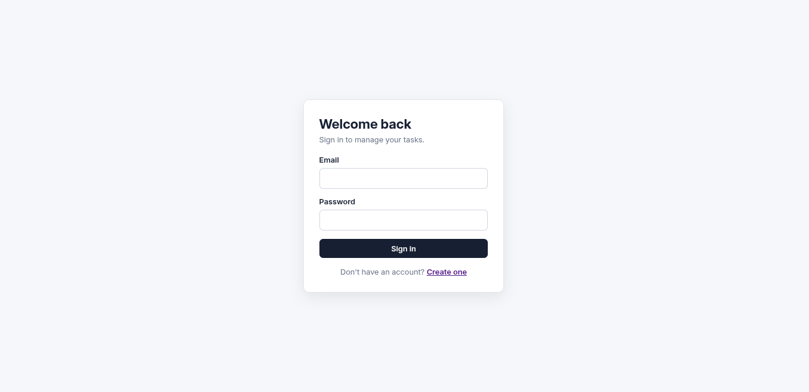
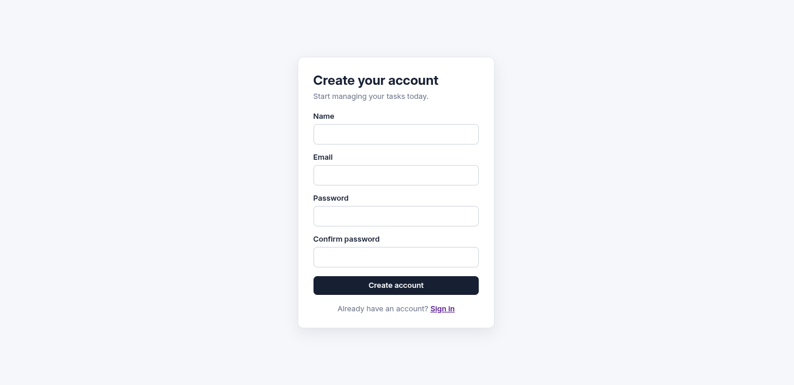
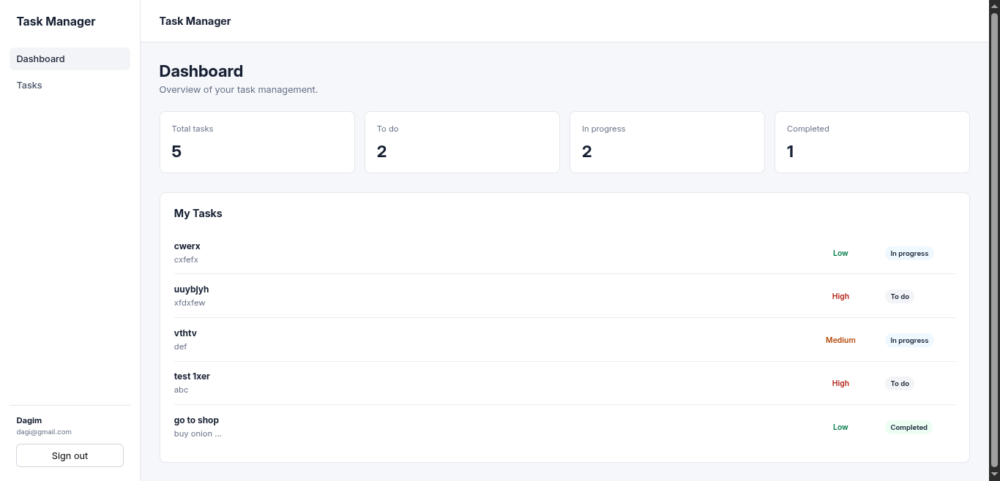
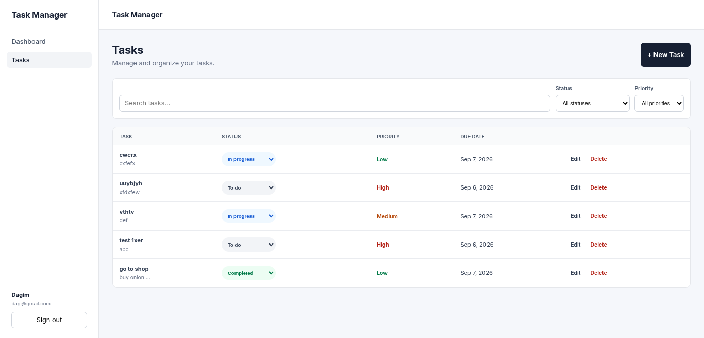
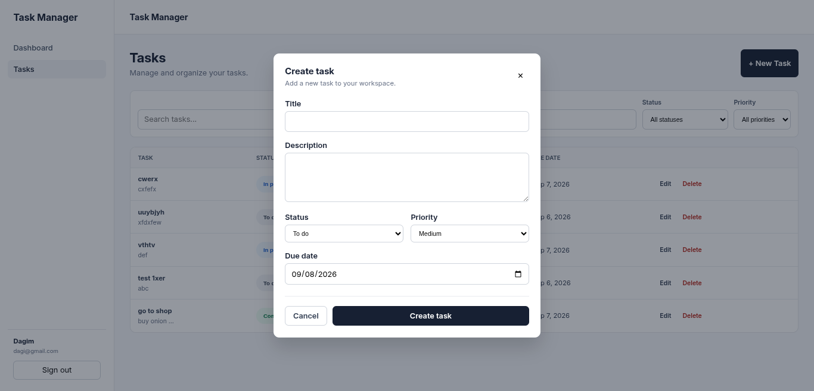
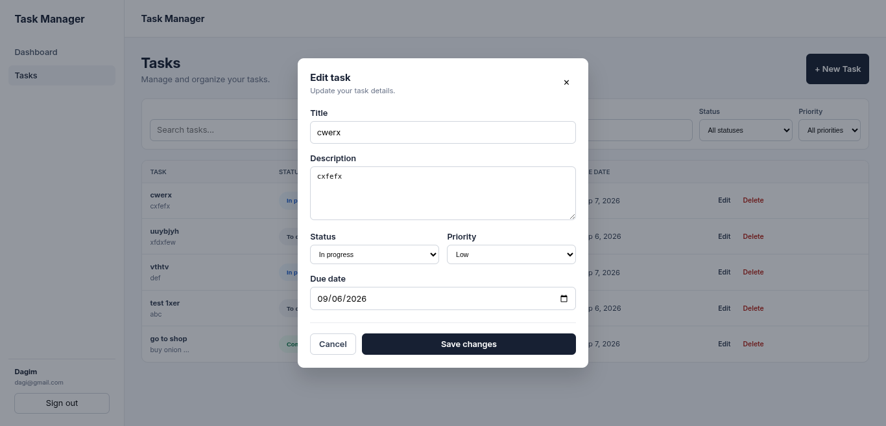
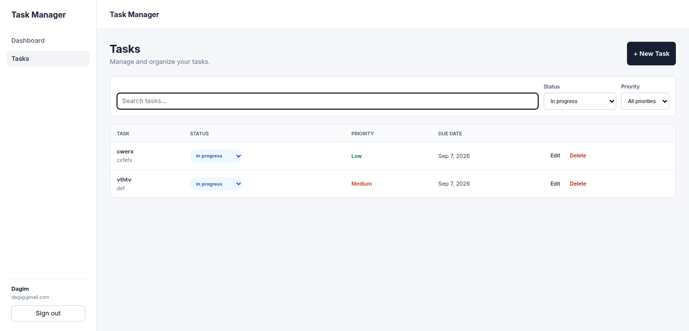
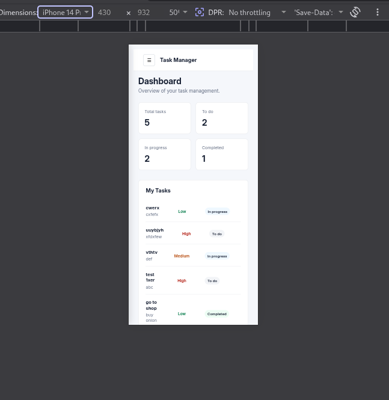

# Task Management SaaS

A full-stack Task Management SaaS application built with **React, Node.js, Express.js, and MySQL**.

The application allows authenticated users to create and manage personal tasks through a responsive web interface backed by a RESTful API.

V1 focuses on building a solid full-stack foundation with authentication, task CRUD operations, authorization, validation, search, filtering, pagination, task statistics, database persistence, automated testing, and security-focused backend practices.

---

## 1. Project Overview

Task Management SaaS is a personal task management application designed to demonstrate professional full-stack software development practices.

Authenticated users can:

- Create an account
- Log in securely
- Access a protected dashboard
- Create tasks
- View tasks
- View individual tasks
- Update tasks
- Delete tasks
- Change task status
- Set task priority
- Set task due dates
- Search tasks
- Filter tasks by status and priority
- Navigate paginated task results
- View task statistics
- Log out

Each task belongs to the authenticated user who created it.

The backend enforces ownership so users cannot access or modify tasks belonging to another user.

---

## 2. Problem Statement

Managing personal tasks becomes difficult when tasks are stored across notes, documents, messages, or multiple applications.

The purpose of this project is to provide a simple centralized application where users can securely manage their tasks from one dashboard.

The application addresses the following problems:

- Lack of centralized task management
- Difficulty tracking task status
- Difficulty organizing tasks by priority
- Difficulty finding specific tasks
- Lack of ownership and authorization controls
- Lack of a structured full-stack architecture

The project also serves as a practical demonstration of building and maintaining a production-oriented full-stack web application.

---

## 3. Project Goals

The main goals of V1 are to:

1. Build secure user authentication.
2. Implement JWT-based authorization.
3. Allow users to manage their own tasks.
4. Provide complete task CRUD functionality.
5. Support task status and priority management.
6. Support task due dates.
7. Provide task search and filtering.
8. Provide pagination for task results.
9. Provide dashboard task statistics.
10. Persist application data using MySQL.
11. Validate incoming user input.
12. Implement centralized error handling.
13. Protect backend endpoints with security middleware.
14. Provide automated frontend and backend tests.
15. Maintain a clean and scalable project structure.
16. Provide professional technical documentation.

---

## 4. Features

### Authentication

- User registration
- User login
- Password hashing with bcrypt
- JWT authentication
- Protected API routes
- Current authenticated-user endpoint
- Protected frontend routes
- Authentication state management
- Logout functionality

### Task Management

- Create tasks
- View tasks
- View individual tasks
- Update tasks
- Delete tasks
- Task status management
- Task priority management
- Task due dates
- Task descriptions
- Task search
- Task filtering
- Pagination
- Task statistics

Supported task statuses:

```text
todo
in_progress
completed
```

Supported task priorities:

```text
low
medium
high
```

### Authorization

Task resources are associated with the authenticated user.

The backend uses the authenticated user's identity from the JWT when performing task operations.

Users can only:

- View their own tasks
- View their own task details
- Update their own tasks
- Delete their own tasks

A user cannot access another user's tasks by changing a task ID in a request.

### Validation

The application validates incoming authentication and task data before processing requests.

Validation is implemented on the backend using request validators and validation middleware.

Examples include:

- Registration validation
- Login validation
- Task creation validation
- Task update validation
- Task ID validation
- Task list query validation

### Error Handling

The backend uses centralized error handling to provide consistent API responses.

The frontend also handles:

- Loading states
- Error states
- Empty states
- Form errors
- Failed API requests

---

## 5. Tech Stack

### Frontend

- React 19
- JavaScript
- JSX
- React Router
- Axios
- Tailwind CSS
- Lucide React
- Vite

### Backend

- Node.js
- Express.js
- JavaScript
- JWT
- bcrypt
- Express Validator
- Zod

### Database

- MySQL
- mysql2
- SQL migrations

### Testing

Frontend:

- Vitest
- Testing Library
- jsdom
- User Event

Backend:

- Jest
- Supertest

### Development Tools

- Git
- GitHub
- npm
- ESLint
- Prettier
- Nodemon
- VS Code

### Backend Security and Infrastructure

- Helmet
- CORS
- Express Rate Limit
- Compression
- Pino logging
- Morgan
- Environment variables

---

## 6. System Architecture

The application uses a **client-server architecture**.

```text
                         ┌──────────────────┐
                         │       User       │
                         └────────┬─────────┘
                                  │
                                  ▼
                         ┌──────────────────┐
                         │  React Frontend  │
                         │     Client       │
                         └────────┬─────────┘
                                  │
                             HTTP / REST
                                  │
                                  ▼
                         ┌──────────────────┐
                         │ Express Backend  │
                         │     Server       │
                         └────────┬─────────┘
                                  │
                         ┌────────┴─────────┐
                         │                  │
                         ▼                  ▼
                 ┌───────────────┐   ┌───────────────┐
                 │ Authentication│   │ Task Services │
                 │ & Middleware  │   │ & Controllers │
                 └───────────────┘   └───────┬───────┘
                                             │
                                             ▼
                                      ┌───────────────┐
                                      │ MySQL Database│
                                      └───────────────┘
```

### Authentication Flow

```text
User
  │
  ▼
Register / Login
  │
  ▼
Backend Validation
  │
  ▼
Password Verification
  │
  ▼
JWT Generation
  │
  ▼
Authenticated Client
  │
  ▼
Protected API Requests
  │
  ▼
JWT Verification
  │
  ▼
Authorized Resource Access
```

The frontend communicates with the backend through REST API endpoints.

The backend contains separate layers for:

- Routes
- Controllers
- Services
- Models
- Middleware
- Validators
- Configuration
- Utilities

---

## 7. Repository Structure

```text
task-manager/
│
├── client/
│   ├── src/
│   │   ├── components/
│   │   │   ├── common/
│   │   │   └── task/
│   │   │
│   │   ├── context/
│   │   ├── hooks/
│   │   ├── layouts/
│   │   ├── pages/
│   │   │   ├── auth/
│   │   │   └── dashboard/
│   │   ├── routes/
│   │   ├── services/
│   │   ├── styles/
│   │   └── test/
│   │
│   ├── package.json
│   └── README.md
│
├── server/
│   ├── migrations/
│   │   ├── 001_create_users_table.sql
│   │   └── 002_create_tasks_table.sql
│   │
│   ├── scripts/
│   │   └── migrate.js
│   │
│   ├── src/
│   │   ├── config/
│   │   ├── controllers/
│   │   ├── middleware/
│   │   ├── models/
│   │   ├── routes/
│   │   ├── services/
│   │   ├── utils/
│   │   └── validators/
│   │
│   ├── tests/
│   ├── package.json
│   └── server.js
│
├── docs/
│   ├── requirements.md
│   ├── architecture.md
│   ├── api.md
│   ├── database.md
│   ├── testing.md
│   ├── security.md
│   ├── deployment.md
│   └── development.md
│
├── .gitignore
└── README.md
```

---

## 8. Screenshots

### Login



### Registration



### Dashboard



### Task Management



### Create Task



### Edit Task



### Filters



### Responsive Design



---

## 9. Installation

### Prerequisites

Make sure the following are installed:

- Node.js
- npm
- MySQL
- Git

Check the installed versions:

```bash
node --version
npm --version
mysql --version
git --version
```

### Clone Repository

```bash
git clone <repository-url>

cd task-manager
```

### Install Dependencies

Install frontend dependencies:

```bash
cd client

npm install
```

Install backend dependencies:

```bash
cd ../server

npm install
```

### Environment Variables

Create a `.env` file inside the `server` directory.

Example:

```env
PORT=5000

DATABASE_HOST=localhost
DATABASE_PORT=3306
DATABASE_USER=root
DATABASE_PASSWORD=your_password
DATABASE_NAME=task_manager

JWT_SECRET=your_jwt_secret
JWT_EXPIRES_IN=7d
```

Create the frontend environment configuration according to the provided `.env.example` file.

Never commit real environment variables or secrets to GitHub.

### Database Setup

Create the MySQL database:

```sql
CREATE DATABASE task_manager;
```

Run the database migrations:

```bash
cd server

npm run migrate
```

The migrations create:

- `users`
- `tasks`

and configure their relationships, constraints, and indexes.

---

## 10. Running the Application

### Start Backend

Open a terminal:

```bash
cd server

npm run dev
```

The backend runs on the configured server port.

By default:

```text
http://localhost:5000
```

### Start Frontend

Open another terminal:

```bash
cd client

npm run dev
```

Vite will display the frontend development URL in the terminal.

Open that URL in your browser.

---

## 11. Testing

The project includes automated tests for important frontend and backend functionality.

### Frontend Tests

Run:

```bash
cd client

npm test
```

Frontend tests cover areas such as:

- Common UI components
- Loading states
- Error states
- Empty states
- Task forms
- Task hooks

### Backend Tests

Run:

```bash
cd server

npm test
```

Backend testing uses Jest and Supertest.

Tests cover areas such as:

- Authentication
- API behavior
- Task operations
- Validation
- Authorization
- Error handling

### Linting

Frontend:

```bash
cd client

npm run lint
```

Backend:

```bash
cd server

npm run lint
```

### Formatting

Backend formatting:

```bash
cd server

npm run format
```

Check formatting:

```bash
npm run check-format
```

---

## 12. API Overview

The backend exposes a REST API.

### Health

```text
GET /health/live
GET /health/ready
```

### Authentication

```text
POST /api/auth/register
POST /api/auth/login
GET  /api/auth/me
```

### Tasks

```text
POST   /api/tasks
GET    /api/tasks
GET    /api/tasks/stats
GET    /api/tasks/:taskId
PATCH  /api/tasks/:taskId
DELETE /api/tasks/:taskId
```

Task listing supports query parameters for:

```text
page
limit
search
status
priority
```

Example:

```text
GET /api/tasks?page=1&limit=20&search=website&status=todo&priority=high
```

Protected task endpoints require a valid JWT authentication token.

For complete endpoint documentation, request/response examples, validation rules, and HTTP status codes, see:

```text
docs/api.md
```

---

## 13. Security

Security is an important part of the V1 implementation.

The application uses:

- bcrypt password hashing
- JWT authentication
- Protected API routes
- User-specific resource authorization
- Input validation
- Parameterized MySQL queries
- Environment variables for secrets
- Helmet security headers
- CORS configuration
- Rate limiting
- Centralized error handling
- Request logging
- Compression

### Password Security

User passwords are never stored as plaintext.

Passwords are hashed before being stored in the database.

### Authentication

Authenticated requests use JWT-based authentication.

The backend verifies the token before allowing access to protected resources.

### Authorization

The authenticated user's ID is used when accessing task resources.

This prevents users from accessing tasks belonging to other users.

### Secrets

Sensitive configuration such as database credentials and JWT secrets must be stored in environment variables.

Real `.env` files must never be committed to the repository.

More detailed security information is documented in:

```text
docs/security.md
```

---

## 14. Documentation

The project documentation is organized into separate technical documents.

```text
docs/
│
├── requirements.md
├── architecture.md
├── api.md
├── database.md
├── testing.md
├── security.md
├── deployment.md
└── development.md
```

### Requirements

Defines the functional and non-functional requirements of the application.

### Architecture

Explains the frontend architecture, backend architecture, authentication flow, authorization, data flow, and system design.

### API

Documents REST API endpoints, authentication requirements, request parameters, request bodies, responses, and error handling.

### Database

Documents the MySQL schema, tables, relationships, constraints, indexes, and migrations.

### Testing

Documents the testing strategy, test types, test structure, and how to run the test suites.

### Security

Documents authentication, authorization, password security, validation, rate limiting, CORS, security headers, and other security practices.

### Deployment

Documents how the frontend, backend, and database can be prepared and deployed to a production environment.

### Development

Documents local development setup, coding workflow, Git workflow, migrations, testing, and development practices.

---

## 15. V1 Scope

V1 focuses on the core functionality required for a complete personal task management application.

### Included in V1

```text
User Registration
       +
User Login
       +
JWT Authentication
       +
Protected Routes
       +
Task CRUD
       +
Task Status
       +
Task Priority
       +
Task Due Date
       +
Task Search
       +
Task Filtering
       +
Pagination
       +
Task Statistics
       +
MySQL Persistence
       +
Input Validation
       +
Authorization
       +
Error Handling
       +
Automated Testing
       +
Security Middleware
```

The goal of V1 is not to implement every possible SaaS feature.

The goal is to establish a clean, maintainable, secure, and testable full-stack foundation that can be extended in future versions.

---

## 16. Future Versions

### V2

V2 can extend the V1 foundation with improved productivity and user experience features.

Potential features include:

- Improved dashboard UI
- Advanced task filtering
- Better task search
- Improved pagination controls
- Task sorting
- Improved task forms
- Better responsive design
- Notifications
- Improved user experience
- More comprehensive automated testing
- Improved API documentation
- Production deployment

### V3

V3 can introduce more advanced SaaS and collaboration capabilities.

Potential features include:

- Projects
- Team workspaces
- Team members
- Task comments
- File attachments
- Task collaboration
- Role-based access control
- Real-time updates
- Redis caching
- Background jobs
- Docker
- CI/CD
- Advanced monitoring
- Production observability
- Scalable infrastructure

Future features will be introduced incrementally rather than adding unnecessary complexity to V1.

---

## 17. Project Status

```text
Version: V1
Status: Completed / Final Review
Focus: Core Task Management
```

### V1 Completion Checklist

- [x] Authentication
- [x] JWT authorization
- [x] Protected routes
- [x] Task creation
- [x] Task listing
- [x] Task details
- [x] Task updating
- [x] Task deletion
- [x] Task status
- [x] Task priority
- [x] Task due date
- [x] Search
- [x] Filtering
- [x] Pagination
- [x] Task statistics
- [x] MySQL database
- [x] Database migrations
- [x] Input validation
- [x] Error handling
- [x] Security middleware
- [x] Frontend tests
- [x] Backend tests
- [ ] Final production deployment
- [X] Final screenshots
- [ ] Final portfolio presentation

---

## 18. License

This project is currently developed as a portfolio and learning project.

A formal open-source license can be added if the project is later published for public contribution or distribution.

---

## Author

**Dagi**

Full-Stack JavaScript Developer

### Technologies

```text
JavaScript
React
Node.js
Express.js
MySQL
REST API
JWT
Git
GitHub
```
